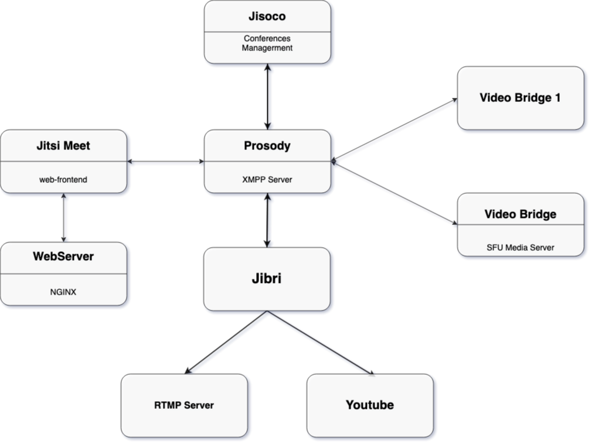

#  Achitecture jitsi meet with Jibri (Jitsi Broadcasting Infrastructure)
# what is Jibri 
Jibri provides services for recording or streaming a Jitsi Meet conference.
It works by launching a Chrome instance rendered in a virtual framebuffer and capturing and encoding the output with ffmpeg. It is intended to be run on a separate machine (or a VM), with no other applications using the display or audio devices. Only one recording at a time is supported on a **single jibri**.
# Installing Jibri
## Installation Note 
### Prequisits**
**System Requiment**
- OS : ubuntu 18.04lts server 
- RAM : 4GB 
- vCPU: 4GB
- Disk:  Minimum 20GB
**Infracture included Jibri and RTMP Server**
 
**
## Install Jibri

### ALSA and Loopback Device
- First make sure the ALSA loopback module is available. The extra modules (including ALSA loopback) can be installed on Ubuntu 16.04 using package name linux-image-extra-virtual
- Perform the following tasks as the root user
    - Set up the module to be loaded on boot: **echo "snd-aloop" >> /etc/modules**
    - Load the module into the running kernel: **modprobe snd-aloop**
    - Check to see that the module is already loaded: **lsmod | grep snd_aloop**
- If the output shows the snd-aloop module loaded, then the ALSA loopback configuration step is complete
### ffmpeg with x11 capture support 
run as root 
```
apt update && apt upgrade -y
sudo add-apt-repository ppa:mc3man/trusty-media
sudo apt-get update
sudo apt-get install ffmpeg
```
### Google Chrome stable & Chromedriver
The latest Google Chrome stable build should be used. It may be able to be installed direclty via apt, but the manual instructions for installing it are as follows:
```
curl -sS -o - https://dl-ssl.google.com/linux/linux_signing_key.pub | apt-key add
echo "deb [arch=amd64] http://dl.google.com/linux/chrome/deb/ stable main" > /etc/apt/sources.list.d/google-chrome.list
apt-get -y update
apt-get -y install google-chrome-stable

```
Add chrome managed policies file and set **CommandLineFlagSecurityWarningsEnabled** to false. It will hide warnings in Chrome. You can set it like so:
```
mkdir -p /etc/opt/chrome/policies/managed
echo '{ "CommandLineFlagSecurityWarningsEnabled": false }' >>/etc/opt/chrome/policies/managed/managed_policies.json
```
Chromedriver is also required and can be installed like so:

```
CHROME_DRIVER_VERSION=`curl -sS chromedriver.storage.googleapis.com/LATEST_RELEASE`
wget -N http://chromedriver.storage.googleapis.com/$CHROME_DRIVER_VERSION/chromedriver_linux64.zip -P ~/
unzip ~/chromedriver_linux64.zip -d ~/
rm ~/chromedriver_linux64.zip
sudo mv -f ~/chromedriver /usr/local/bin/chromedriver
sudo chown root:root /usr/local/bin/chromedriver
sudo chmod 0755 /usr/local/bin/chromedriver
```
### Miscellaneous required tools
See the debian control file for the dependencies that are required. These can be installed using the following: 

```
sudo apt-get install default-jre-headless ffmpeg curl alsa-utils icewm xdotool xserver-xorg-input-void xserver-xorg-video-dummy
```

###  jitsi Debian Repository 
add key: 
```
wget -qO - https://download.jitsi.org/jitsi-key.gpg.key | sudo apt-key add -
```
Create a sources.list.d file with the repository:
```
Create a sources.list.d file with the repository:

```
Update your package list:
```
sudo apt-get update
```
Install the latest jibri


```
sudo apt-get install jibri
```
### User, group 
- Jibri is currently meant to be run as a regular system user. This example creatively uses username 'jibri' and group name 'jibri', but any user will do. This has not been tested with the root user.
- Ensure that the jibri user is in the correct groups to make full access of the audio and video devices. The example jibri account in Ubuntu 16.04 are: "adm","audio","video","plugdev".

```
sudo usermod -aG adm,audio,video,plugdev jibri

```
## Configure Jitsi Meet Environments for jibri
Jibri requires some settings to be enabled within a Jitsi Meet configuration. These changes include virtualhosts and accounts in Prosody, settings for the jitsi meet web (within config.js) as well as **jicofo sip-communicator.properties.**
### Prosody 
Create the internal MUC component entry. This is required so that the jibri clients can be discovered by Jicofo in a MUC that's not externally accessible by jitsi meet users. Add the following in */etc/prosody/prosody.cfg.lua:*

```
Component "internal.auth.<domain-name>" "muc"
    modules_enabled = {
      "ping";
    }
    storage = "null"
    muc_room_cache_size = 1000

```
Create the recorder virtual host entry, to hold the user account for the jibri chrome session. This is used to restrict only authenticated jibri chrome sessions to be hidden participants in the conference being recordered. Add the following in */etc/prosody/prosody.cfg.lua*:
```
VirtualHost "recorder.<domain-name>"
  modules_enabled = {
    "ping";
  }
  authentication = "internal_plain
```
Setup the two accounts jibri will use.
```
prosodyctl register jibri auth.yourdomain.com jibriauthpass
prosodyctl register recorder recorder.yourdomain.com jibrirecorderpass
```
### Jitcofo
edit file **/etc/jitsi/jicofo/sip-communicator.properties** and add two lines into the files: 
```
org.jitsi.jicofo.jibri.BREWERY=JibriBrewery@internal.auth.domain-name
org.jitsi.jicofo.jibri.PENDING_TIMEOUT=90 

```
### Jitsimeet
Edit the /etc/jitsi/meet/yourdomain-config.js file, add/set the following properties:
```
fileRecordingsEnabled: true, // If you want to enable file recording
liveStreamingEnabled: true, // If you want to enable live streaming
hiddenDomain: 'recorder.yourdomain.com',
```
Note: Make sure to update Jibri's **config.json** appropriately to match any config done above.

## Start Jibri 
Once you have configured **config.json**, start the jibri service:
```
sudo systemctl restart jibri
```


# Setup RTMP Server 
### Spin up an Ubuntu VM.
**prefer to run as root**
```
apt update && apt upgrade -y

```
**Install nginx and the required packages:**
```
apt install build-essential libpcre3 libpcre3-dev libssl-dev nginx libnginx-mod-rtmp ffmpeg -y

```
**Edit nginx.conf** and add the follow lines. Make sure to adjust 
```
rtmp {
        server {
                listen 1935;
                chunk_size 4096;
                notify_method get;

                application live {
                             on_publish http://localhost/auth;
                             live on;
                             record all;
                             record_path /var/www/html/recordings;
                             record_unique on;
                             # Define the applications to which the stream will be pushed, comment them out to disable the ones not needed:
                             push rtmp://localhost/twitch;
                             push rtmp://localhost/facebook;
                }

                      # Twitch Stream Application
                      application twitch {
                          live on;
                          record off;

                          # Only allow localhost to publish
                          allow publish 127.0.0.1;
                          deny publish all;

                          # Push URL with the Twitch stream key
                          push rtmp://live-cdg.twitch.tv/app/<twitch_stream_key>;
                      }

                      # Facebook Stream Application  
                      application facebook {
                          live on;
                          record off;

                          #Only allow localhost to publish
                          allow publish 127.0.0.1;
                          deny publish all;

                          # Push URL with the Facebook stream key
                          push rtmps://live-api-s.facebook.com:443/rtmp/<facebook_stream_key>;

                      }
                  }
}
```

**Create the directory for recordings and make it writeable to the web server software:**

```
mkdir -p /var/www/html/recordings
chown -R www-data:www-data /var/www/html/recordings/
```
**Open the file */etc/nginx/sites-enabled/default* in a text editor and add a *location* block to the server configuration:**
```
location /auth {
        if ($arg_pwd = 'a_secret_password') {
            return 200;
            }
            return 401;
}
```
Replace **a_secret_password** with a secret password of your choice which authenticates against the server for broadcasting streams.

**Restart the Nginx web server:**
```
systemctl restart nginx.service
```

# This has last step to be done on the Jibri Server
## ffmpeg rtmp Script
**Add a directory**
```
mkdir -p /opt/util

cd /opt/util

vi ffmpeg

```

paste the script below into the file & save
```
#!/usr/bin/bash

COMANDO="/usr/bin/ffmpeg"

while test $# -gt 0
do
    T="$1"
    if [ "${T:0:32}" == "rtmp://a.rtmp.youtube.com/live2/" ]; then
	COMANDO="$COMANDO rtmp://my-server-for-rtmp:1935/sub-rtmp-url/${T:32}"
    else
	COMANDO="$COMANDO $T"
    fi
    shift
done

echo "Llamando a ffmpeg sustituyendo rtmp si hay: «$COMANDO»."

exec $COMANDO 
PROCESO_FFMPEG=$!

echo "Esperando finalización del proceso: ${PROCESO_FFMPEG}."
wait $PROCESO_FFMPEG
```
**MAKE SURE of the location of /bin/bash & /usr/bin/ffmepg (which bash & which ffmpeg)**
```
$ which bash
/usr/bin/bash
$ which ffmpeg
/usr/bin/ffmpeg
```
convert the file to be executable

```
chmod +x ffmpeg
```
Then I’ve edited the jibri service with:
```
systemctl edit --full jibri
```
and specify:
```
[Service]
Environment="PATH=/opt/util:/usr/lib/jvm/oracle-java8-jdk-amd64/jre/bin:/usr/local/sbin:/usr/local/bin:/usr/sbin:/usr/bin:/sbin:/bin"
...
```
## OK, DONE. check in the setting on the room. And start stream and enjoy ? good luck for u 
