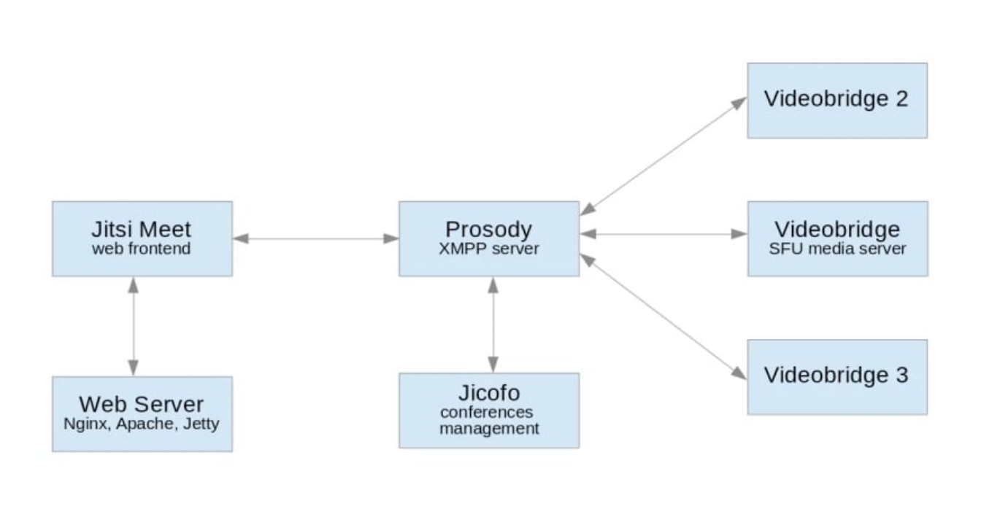

# Jitsi multiple Node
## Introduction
Jitsi meet has an in-built load balancing functionality, and can be configured to manage multiple Videobridge nodes for hosting meeting conferences. Each videobridge component is responsible for streaming media data to all the participants of a given set of meeting. To configure Jitsi meet with multiple videobridge nodes, we will need to change all the videobridge node to publish their status to the default XMPP server. At the same time, we will change the Jicofo component in Jitsi meet to subscribe to the XMPP node for events published by all videobridge nodes.

## Prequisits
In this article, we assume you already have a server (Server A) with default Jitsi Meet installation, and we going to set up a second videobridge in a separate server machine (Server B).
-  Ubuntu machine with Default Jitsi Meet installation (Server A).
-  Ubuntu server 18.04 LTS or later (Server B).

## PART 1: Configuration Change to Server A 
Let's SSH into server A, this machine has a default jitsi meet installation , and by default it also has one videobridge component. 
Please note in this tutorial, the domain name <domainname> or <dnsname> is the domain of the main Jitsi server (Server A).
### Step 1: Add the JID of the VideoBridges 
First , we need to allow all videobridges to be able to create their own pubsub nodes. Let's add the JIDs of the videobridge nodes to Prosody. In Prosody configuration /etc/prosody/conf.d/<dnsname>.cfg.lua, add the following line under authentication = ...
```
  admins = {
    "jitsi-videobridge.<dnsname>",
    "videobridge2.<dnsname>",
  }

```

In this tutorial we use the above two subdomains jitsi-videobridge and videobridge2 as dns for each videobridge node. In some Jitsi versions, jitsi-videobridge is the default domain name used by videobridge. videobridge2 is the domain we chose for the second videobridge node. After the change, your configuration file should look like below.

```
VirtualHost "<dnsname>"
  -- enabled = false -- Remove this line to enable this host
  authentication = "internal_plain" //Note this value can be "anonymous", if you haven't enabled authentication
  admins = {
    "jitsi-videobridge.<dnsname>",
    "videobridge2.<dnsname>",
  }
  ...
```
### Step 2. Change configuration of default Videobridge node 

Now, edit the videobridge configuration in /etc/jitsi/videobridge/config, and look for the configuration line JVB_OPTS="--apis=,", and change it to following.

```
JVB_OPTS="--apis=rest,xmpp --subdomain=jitsi-videobridge"
JVB_HOST=<domainname> 
```

### Step 3. Change Prosody to listen to public interface 

Since we going to have lots of videobridge nodes connecting from outside the server box, we need to change Prosody to listen to the public network. Edit the prosody configuration /etc/prosody/prosody.cfg.lua to listen for public IP, add the following configuration under admin = { }

```
component_ports = {5347}
component_interface = "<IPaddress>"  
```
### Step 4. Change Jicofo configuration to use public domain 

Now, change the following configuration files to replace localhost with your jitsi domain.
First, **/etc/jitsi/jicofo/config**


```
JICOFO_HOST=<domainname>
 ```
### Step 5. Change default Videobridge node to use pubsub 

In **/etc/jitsi/videobridge/sip-communicator.properties** to enable statistics and to set statistics to use pubsub, make the following changes. Add the following lines if they are missing, or otherwise if **STATISTIC_TRANSPORT** is set to **muc** change it to **pubsub**.

```
org.jitsi.videobridge.ENABLE_STATISTICS=true
org.jitsi.videobridge.STATISTICS_TRANSPORT=pubsub
org.jitsi.videobridge.PUBSUB_SERVICE=<domainname>
org.jitsi.videobridge.PUBSUB_NODE=sharedStatsNode
```

### Step 6. Change Jicofo to subscribe to pubsub node 

In **/etc/jitsi/jicofo/sip-communicator.properties**
file, adding the following lines

```
org.jitsi.focus.pubsub.ADDRESS=<domainname>
org.jitsi.focus.STATS_PUBSUB_NODE=sharedStatsNode
```


### Step 7. Open Ports on the main server (Server A)

Make sure the following ports are open:
-   TCP/UDP Port 5347
-   TCP/UDP Port 5222 //TODO: verify the purpose of this port

## PART 2. Changes on the second videobridge server (Server B) 

Now, let's install the second Videobridge on the other server. First, SSH on to the second server (Server B).

### Step 1. Add the Jitsi package library 

Run following command as super user to add the Jitsi debian package and key.

```
$ echo 'deb https://download.jitsi.org stable/' | sudo tee /etc/apt/sources.list.d/jitsi-stable.list
$ wget -qO -  https://download.jitsi.org/jitsi-key.gpg.key | sudo apt-key add -

```

If you hit an error like gnupg, gnupg2 and gnupg1 do not seem to be installed, you will need to install gnupg or gnupg2 using apt-get install gnupg2. Then you can add the key after that.

### Step 2. Install jitsi videobridge 

run the following command

```
$ apt-get update
$ apt-get install jitsi-videobridge
```

During the installation, we will get prompted for domain name of the main server, replace **localhost** with the domain name of the main server.

### Step 3. Configure Videobridge to use pubsub 

in **/etc/jitsi/videobridge/sip-communicator.properties** to enable statistics and to set statistics to use pubsub, make the following changes. Add the following lines if they are missing, or otherwise if **STATISTIC_TRANSPORT** is set to **muc**, change it to **pubsub** . Make sure the **domainname** is pointing to server A.

```
org.jitsi.videobridge.ENABLE_STATISTICS=true
org.jitsi.videobridge.STATISTICS_TRANSPORT=pubsub
org.jitsi.videobridge.PUBSUB_SERVICE=<domainname>
org.jitsi.videobridge.PUBSUB_NODE=sharedStatsNode
```
### Step 4. Configure Videobridge to connect to the main server 

Now, edit the videobridge configuration in **/etc/jitsi/videobridge/config** , and look for the configuration line JVB_OPTS="--apis=,", and change it to following.

```
JVB_OPTS="--apis=rest,xmpp --subdomain=videobridge2" 
JVB_HOST=<domainname> 
```

By default, the JID uses jitsi-videobridge as the default subdomain, so in this second node, we set the subdomain as videobridge2.

## PART 3. Add new videobridge components to main Jitsi server (Server A) 

### Step 1. Set videobridge credentials 

Log back onto Serve A. Edit the file in **/etc/prosody/conf.d/<dnsname>.cfg.lua**, at the bottom of the main VirtualHost add the following

```
Component "videobridge2.<dnsname>" //This is the domain name of the second videobridge
   component_secret = "<password>" //This can be found on second VB, under /etc/jitsi/videobridge/config
```

Check the component list, make sure the componet_secret of Component "jitsi-videobridge..." is set, and is the same as the value in /etc/jitsi/videobridge/config on server A. Note in some Jitsi Meet version, this setting can be missing, so make sure you add this component if it's missing.

```
Component "jitsi-videobridge.<dnsname>" //This is the domain name of the default videobridge
   component_secret = "<password>" //This can be found on first VB, under /etc/jitsi/videobridge/config
```
### Step 2. Restart the services on Server A 

```
$ sudo service prosody reload
$ sudo service jicofo restart
$ sudo service jitsi-videobridge2 restart
$ sudo service nginx restart
```

### Step 3. Restart videobridge on Server B 

```
$ sudo service jitsi-videobridge restart
```

Done.

Check the following log files on Server A to verify the videobridge nodes are joined successfully.

```
$ tail -f /var/log/jitsi/jicofo.log
$ tail -f /var/log/jitsi/jvb.log
$ /var/log/prosody/prosody.log
```

In your prosody.log file, you should see something like this.
videobridge2.<domainname>:component info External component successfully authenticated

Check the following log files on Serve B.
```
/var/log/jitsi/jvb.log
```
